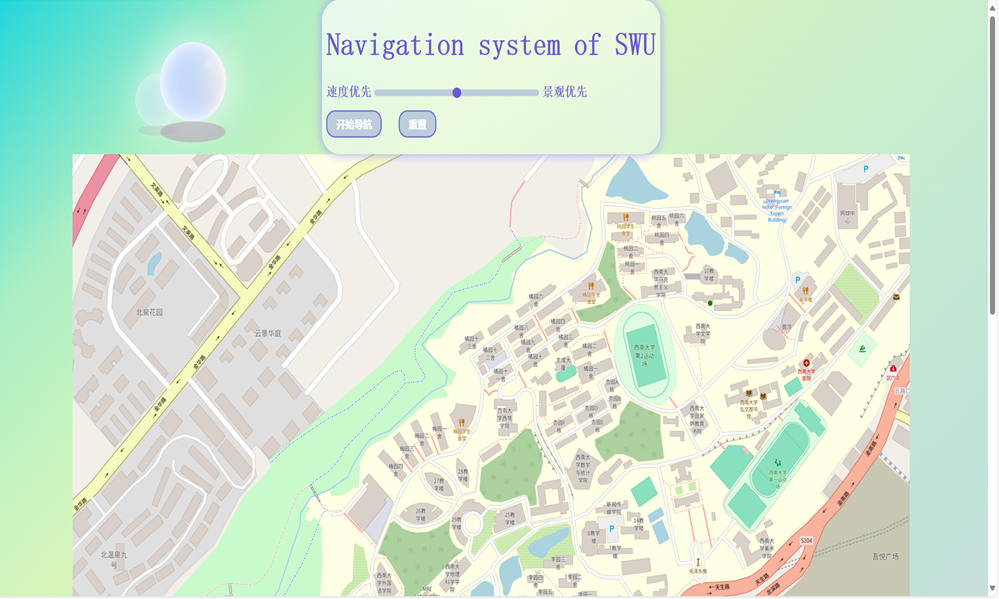
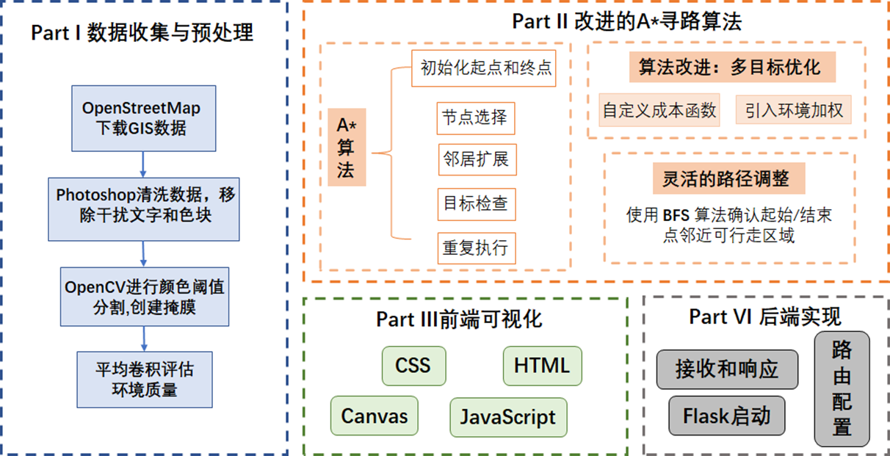

# 基于改进的A\*算法的校园导航系统

一个基于改进的A\*算法的校园导航系统，能为用户提供精准高效的导航服务，并且满足不同场景下用户的需求。以西南大学为例：

**系统特色：**

- **可视化与用户交互**

  可视化界面直观易用，用户体验好

- **多维度路径选择**

  提供了“速度优先”和“景观优先”两种导航偏好

- **智能路径规划**

  能够根据A*算法进行实时计算

- **灵活的用户设置**

  用户可以通过滑动调整偏好占比

**技术架构：**

